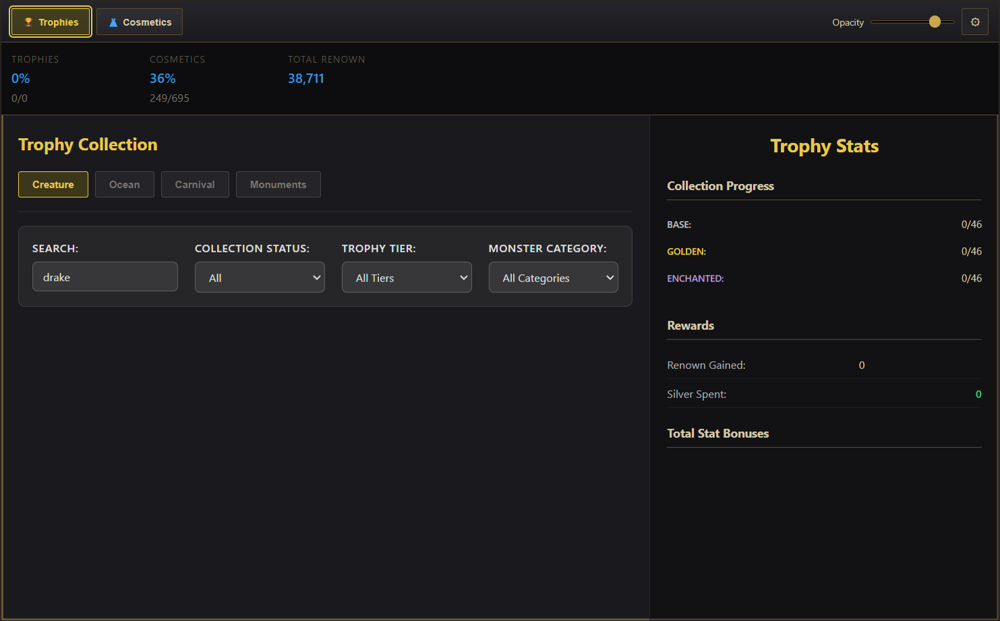
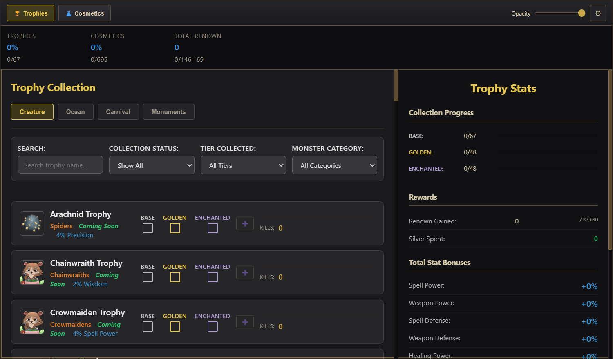
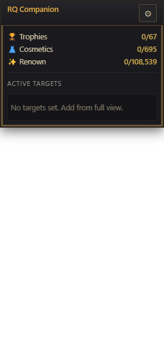
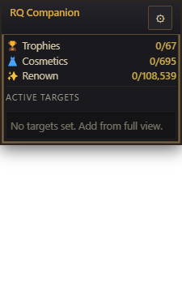
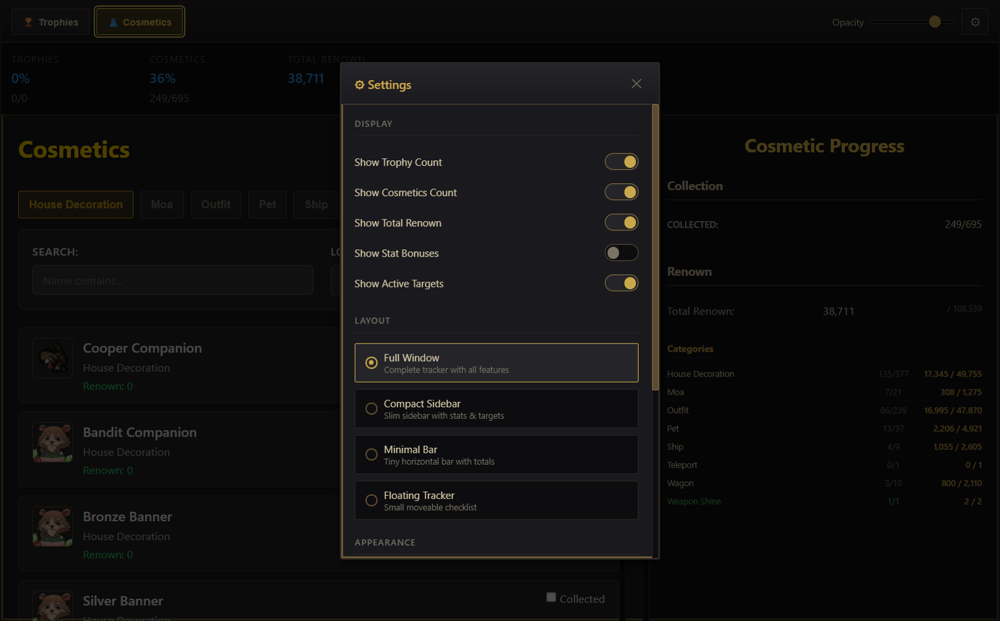
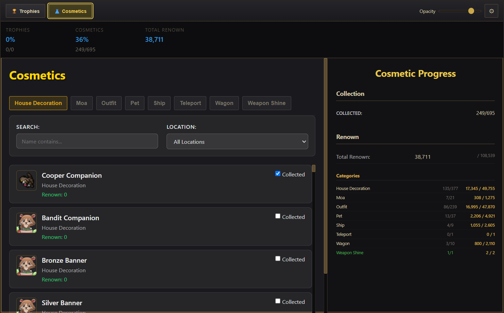
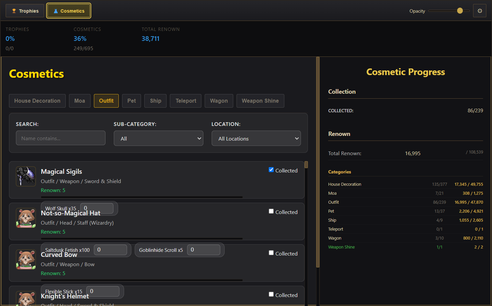
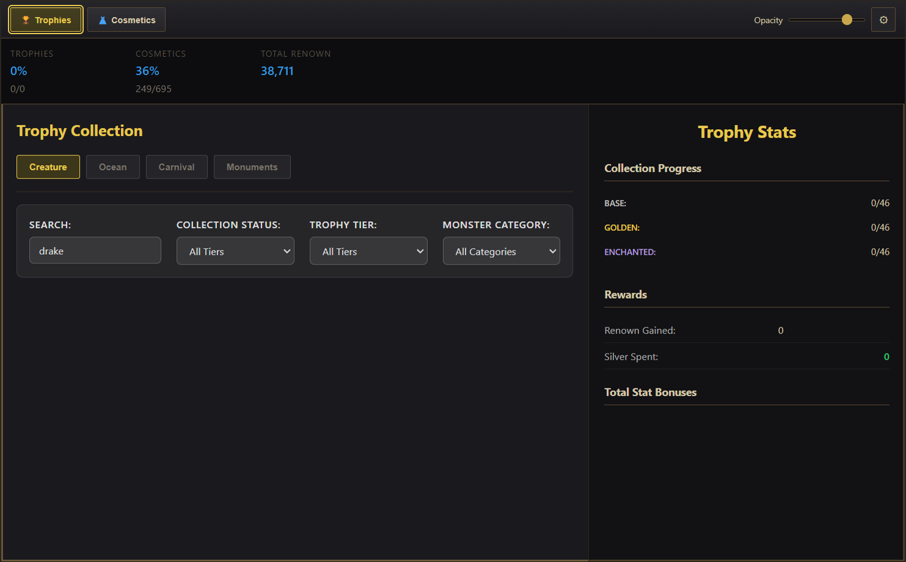
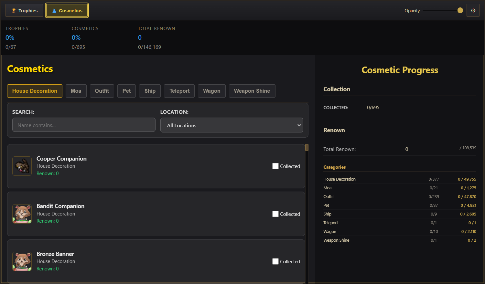
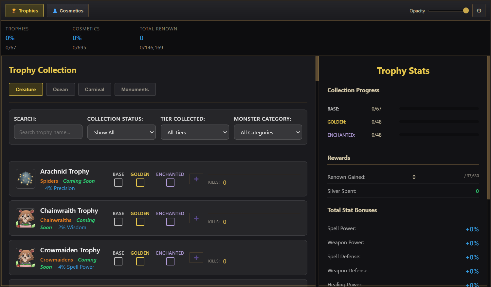

# RavenQuest Companion

<p align="center">
  
</p>

<p align="center">
  <strong>Track your trophies, cosmetics, and progress in RavenQuest</strong>
</p>

<p align="center">
  Version: 1.4.0 | Windows Desktop App | Electron
</p>

---

## ✨ Features

### 🏆 Trophy Tracking
Track all trophy types with three collection tiers (Base, Golden, Enchanted):

- **Creature Trophies** - Hunt creatures and track your kills
- **Ocean Trophies** - Sea monster hunting progress
- **Monuments** - Boss kills with shared counter
- **Carnival Trophies** - Wheel spins and gambling stats


### 📊 Kill Counters & Milestones
- Track kills per trophy type
- Record how you acquired each tier (Collected, Purchased, Gambled)
- Milestone history preserved even after counter resets

### 🎭 Cosmetics Tracking
Track 695+ cosmetic items across categories:
- Outfits, Mounts, Weapon Shines, Teleports, and more
- Category-by-category renown breakdown
- Progress toward max renown


### 🔍 Powerful Filtering
Find what you're looking for quickly:

| Filter Type | Options |
|-------------|---------|
| **Search** | Filter by name |
| **Status** | All, Complete, Partial, Uncollected |
| **Tier** | Base, Golden, Enchanted collected |
| **Category** | Trophy type or cosmetic category |



### ⚙️ Multiple View Modes
Adapt the app to your playstyle:

| Mode | Description | Screenshot |
|------|-------------|------------|
| **Full View** | Complete tracking interface |  |
| **Compact Sidebar** | Slim sidebar with stats & targets |  |
| **Floating Tracker** | Small moveable checklist |  |

### 📈 Dashboard Stats
Real-time progress in the top bar:
- Trophy completion percentage
- Cosmetic collection progress  
- Total renown earned vs maximum

### 🔒 Data Management
- Local persistence (works offline)
- Reset counters only or full progress reset
- Data stored via electron-store



---

## 🚀 Quick Start

```bash
# Install dependencies
npm install

# Run the app
npm start
```

### Build for Windows

```bash
npm run build
```

Output goes to `dist/`.

---

## 🎮 Hotkeys

| Hotkey | Action |
|--------|--------|
| `Ctrl+Alt+F12` | Toggle overlay visibility |

Configurable in Settings panel.

---

## 📸 Screenshots Gallery

<details>
<summary>Click to expand all screenshots</summary>

### Trophy Categories

**Creature Trophies**


**Ocean Trophies**


**Monuments (Shared Boss Counter)**


**Carnival Trophies**


### Cosmetics

**Full Cosmetics View**


**Mounts Category**


**Outfits Category**


### Filtering

**Completed Trophies**


**Partially Collected**


**Uncollected**


**Filter by Tier**


### View Modes

**Full View - Trophies**


**Full View - Cosmetics**


**Compact Sidebar**


**Floating Tracker**


**Settings Window**


</details>

---

## 🗂️ Project Structure

```
ravenquest-companion/
├── main.js           # Electron main process
├── preload.js        # Context bridge
├── package.json
├── assets/           # Icons and images
├── data/             # JSON datasets
│   ├── cosmetics.json
│   ├── creature-trophies.json
│   ├── ocean-trophies.json
│   ├── aether-trophies.json
│   └── carnival-trophies.json
├── renderer/         # UI files
│   ├── index.html
│   ├── styles.css
│   ├── tabs.js
│   ├── trophies.js
│   ├── cosmetics.js
│   └── settings.js
├── src/              # Utilities
│   ├── timeUtils.js
│   ├── dataValidation.js
│   └── ipcValidation.js
├── tests/            # Jest tests
└── docs/             # Documentation & screenshots
```

---

## 🧪 Testing

```bash
# Run all tests
npm test

# Run linter
npm run lint
```

---

## 🔧 Development

### Requirements
- Node.js 18+
- Windows 10/11

### Icon Regeneration
If you update `assets/icon.jpg`:

```powershell
cd assets
magick convert icon.jpg -define icon:auto-resize="16,24,32,48,64,128,256" icon.ico
```

### Capture Screenshots
```bash
npx electron scripts/capture-screenshots.js
```

---

## 📝 Changelog

See [CHANGELOG.md](CHANGELOG.md) for version history.

---

## 📄 License

See [LICENSE](LICENSE).

---

<p align="center">
  Made for the RavenQuest community 🎮
</p>
